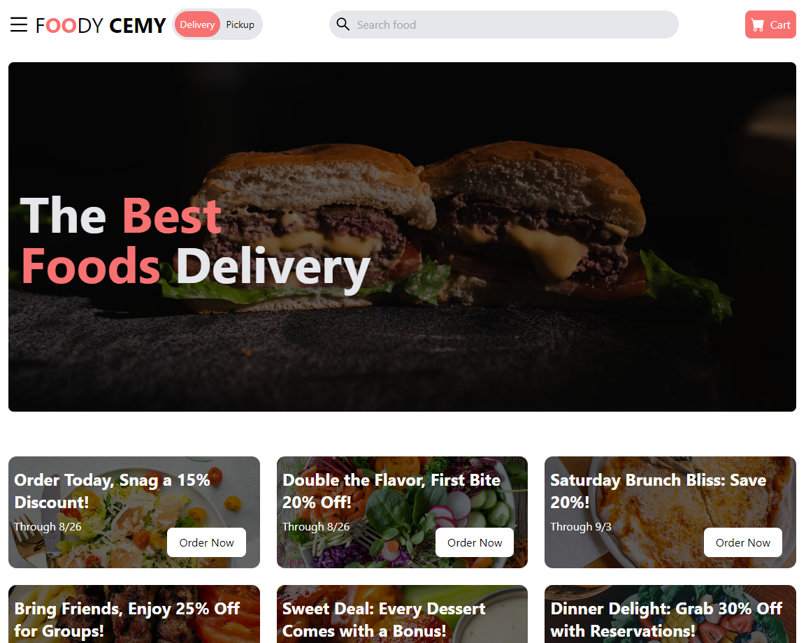
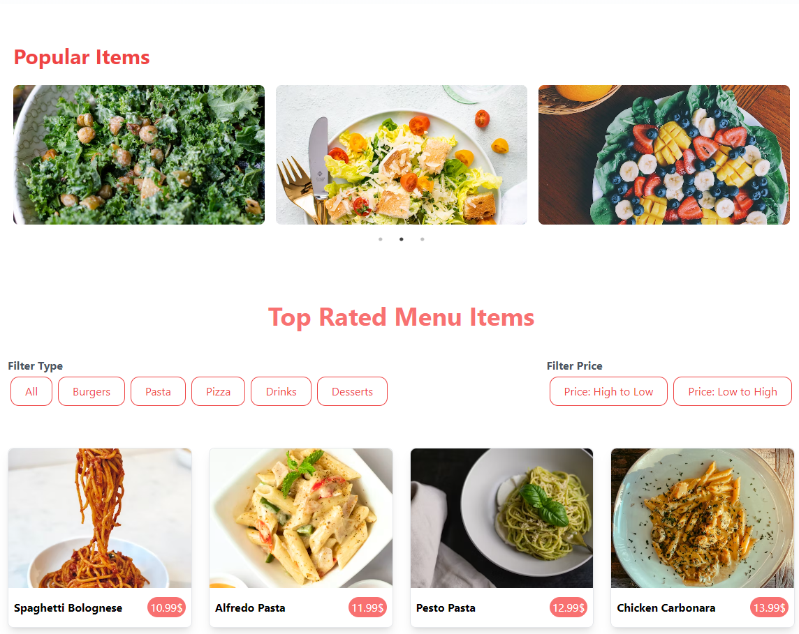
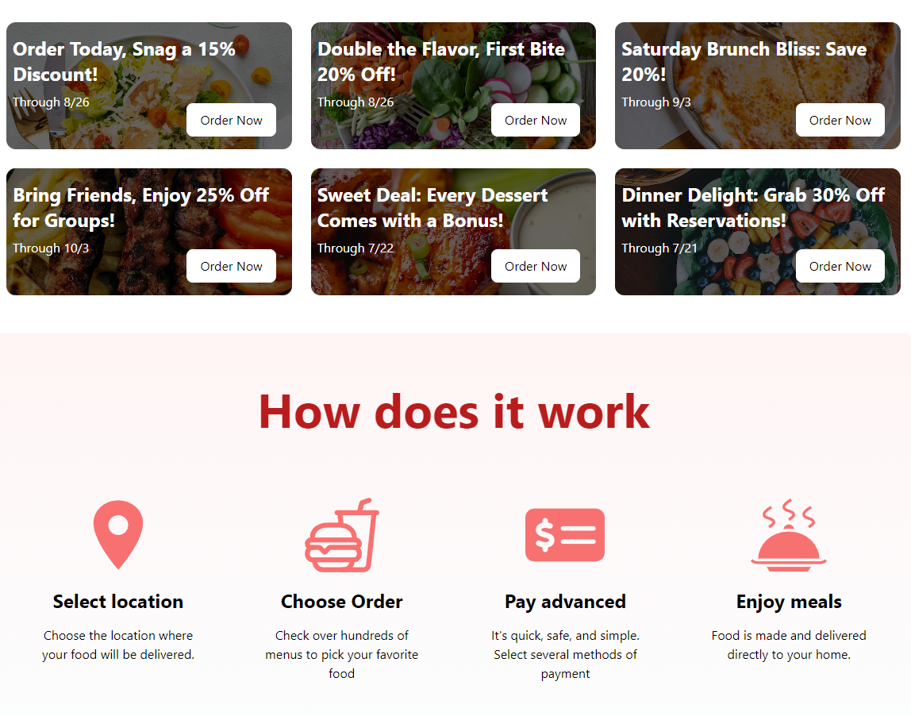

# FoodyCemy

## Bu proje, kullanıcıların çeşitli restoranlardan yemek siparişi verebileceği basit bir web uygulamasını içermektedir. React ve Tailwind CSS kullanılarak geliştirilmiştir.


## Demo


  
## Kullanılan Teknolojiler

**İstemci:** React, React-Slick, React-icons, TailwindCSS


  
## Bilgisayarınızda Çalıştırın

Projeyi klonlayın

```bash
  git clone https://github.com/cemkarakuss/FoodyCemy
```

Proje dizinine gidin

```bash
  cd my-project
```

Gerekli paketleri yükleyin

```bash
  npm install
```

Sunucuyu çalıştırın

```bash
  npm run start
```

  



  


    


  


    
